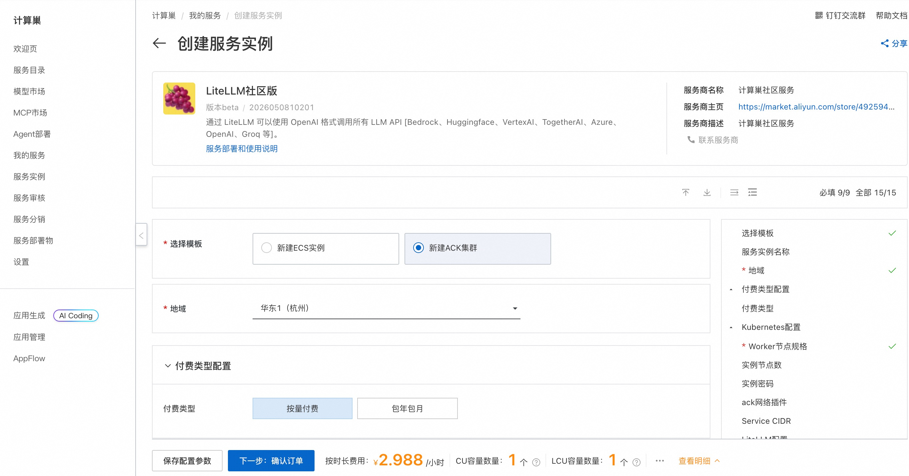
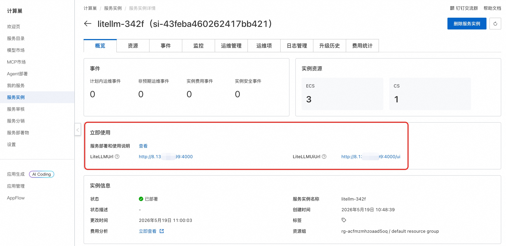
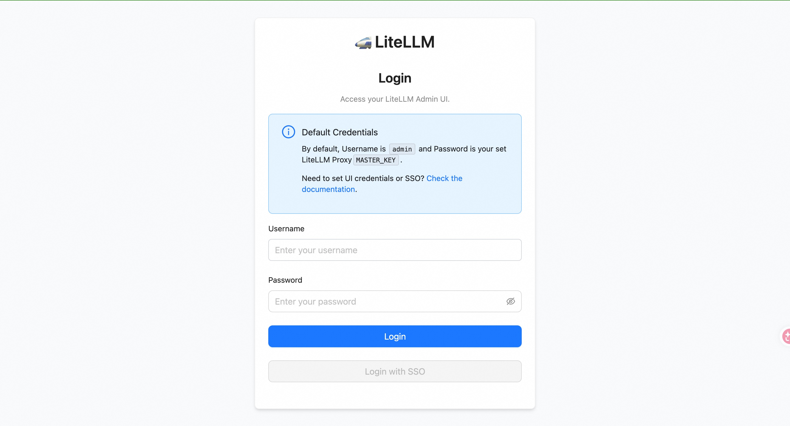

# LiteLLM社区版ACK版部署

## 概述
通过 LiteLLM 可以使用 OpenAI 格式调用所有 LLM API [Bedrock、Huggingface、VertexAI、TogetherAI、Azure、OpenAI、Groq 等]。 访问[LiteLLM官网](https://www.litellm.ai/)了解更多详情。

## 部署流程
1. 访问LiteLLM社区版[部署链接](https://computenest.console.aliyun.com/service/instance/create/cn-hangzhou?type=user&ServiceId=service-d57bfd6e5c724304bf55)，选择**新建ACK部署**，按提示填写部署参数：
    

2. 参数填写完成后可以看到对应询价明细，确认参数后点击**下一步：确认订单**。 确认订单完成后同意服务协议并点击**立即创建**进入部署阶段。

3. 等待部署完成后进入服务实例管理, 在控制台找到LiteLLM服务访问链接。
    

4. 单击链接访问服务。
    

## 参考文档
 [LiteLLM官网文档](https://docs.litellm.ai/docs/proxy/docker_quick_start)
